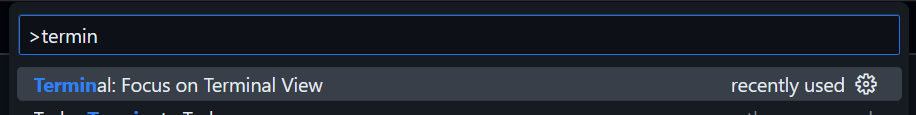
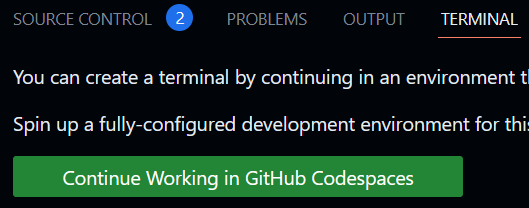
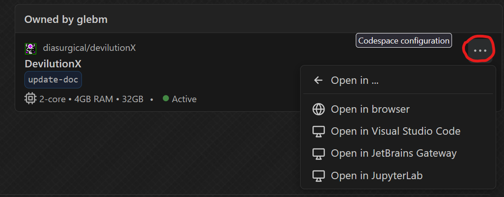

# Developing with GitHub Codespaces

A GitHub codespace container with all dependencies and several useful tools preinstalled is configured in the `.devcontainer` directory.

To develop in a codespace, open the in-browser VS Code editor by either pressing the `.` or going to https://github.dev/diasurgical/devilutionX/.

Then, focus on the terminal window from the Command Palette menu (<kbd>F1</kbd>):

Then, click "Continue Working in GitHub Codespaces":

It will take a few minutes to build the container.

Once installed, the page will load back into the in-browser VS Code editor but now with a
container shell.

To view the graphical desktop of the container, click Ports > Browser.

The password is `vscode`.

For more information about the desktop environment, see https://github.com/devcontainers/features/tree/main/src/desktop-lite

Once you have a codespace set up, you can reuse it in the future by going to "Your codespaces" on GitHub (https://github.com/codespaces):

